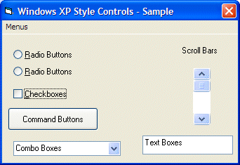



## Real Windows XP Controls in Windows XP / VB6 without images or custom controls

### Description

Ever wanted your VB6 apps to fit in with Windows XP? Now you can do just that. There are other samples on this site that accomplish this, but they use user controls or images - which means that the controls are slow and may not be resizable - and they're large. Want a better solution? This is it. Real Windows XP controls on Windows XP that match the user's visual style (i.e. theme), without user controls or images, with only one API call. You can even use the standard Visual Basic controls (buttons, scrollbars, checkboxes, etc.) and it will work - all with the speed of a native application. Because it is a native application, using Windows to draw the controls.
 
### More Info
 

             |
---                |---
**Submitted On**   |2002-01-07 00:24:28
**By**             |[Brian Cairns](https://github.com/Planet-Source-Code/PSCIndex/blob/master/ByAuthor/brian-cairns.md)
**Level**          |Beginner
**User Rating**    |4.8 (91 globes from 19 users)
**Compatibility**  |VB 5\.0, VB 6\.0
**Category**       |[Custom Controls/ Forms/  Menus](https://github.com/Planet-Source-Code/PSCIndex/blob/master/ByCategory/custom-controls-forms-menus__1-4.md)
**World**          |[Visual Basic](https://github.com/Planet-Source-Code/PSCIndex/blob/master/ByWorld/visual-basic.md)
**Archive File**   |[Real\_Windo46901172002\.zip](https://github.com/Planet-Source-Code/brian-cairns-real-windows-xp-controls-in-windows-xp-vb6-without-images-or-custom-controls__1-30480/archive/master.zip)

### Source Code

Windows XP user? 
So am I. But I didn't want to buy VB.NET. VB6 works just fine, thank you - except for one thing: "Visual Styles". How do you get your controls to have the new look and feel of Windows XP? Images or custom controls work, but the're big, hard to use, slow, and they usually don't support Windows XP visual styles (themes) - let alone large fonts or any of the other features in true Windows XP controls. So how do we make these "true" controls. It's easier than you might imagine.  
<b>Step 1: </b>Create a new project. Add your controls, just like you would normally. Add your code. It is recommended that you add the themed controls last because it is a simple procedure that can be applied once your entire project is done. There is no need to use custom controls, or to add special source. All nececary source is added when you theme your project (only about 10 lines)  
<b>Step 2: </b>Compile (make) your application into an EXE file.
If you open the application now it will have the "classic" visual style. This is for a reason. Your application is using the old Windows Common controls. How do we change this? With a MANIFEST file.  
If you're not using Windows XP, stop here. MANIFEST files work only under Windows XP. You can add one without ill effects under other Windows operating systems, but you won't get the new controls if you don't have Windows XP. For Windows-XP like controls without Windows XP, this is the wrong place.  
What is a MANIFEST file? A MANIFEST file is a text file with the same name as your EXE but with .MANIFEST on the end. For example, the MANIFEST file for "test.exe" would be "test.exe.MANIFEST". The ".MANIFEST" must be in all capitol letters.  
<b>Step 3: </b>Create a new text file with the same name as your EXE, except with ".MANIFEST" on the end. ".MANIFEST" must be in all caps. For example, for "test.exe", you would make a text file named "test.exe.MANIFEST". Notepad will suffice for creating the file.  
<b>Step 4: </b>Add the following text to your MANIFEST file:  
<i>
&#60;?xml version="1.0" encoding="UTF-8" standalone="yes"?&#62; 
&#60;assembly xmlns="urn:schemas-microsoft-com:asm.v1" manifestVersion="1.0"&#62;  
 &#60;assemblyIdentity version="1.0.0.0" processorArchitecture="x86" name="prjThemed" type="win32" /&#62;  
 &#60;dependency&#62;  
 &#60;dependentAssembly&#62;  
  &#60;assemblyIdentity type="win32" name="Microsoft.Windows.Common-Controls" version="6.0.0.0" processorArchitecture="x86" publicKeyToken="6595b64144ccf1df" language="*" /&#62;  
 &#60;/dependentAssembly&#62;  
 &#60;/dependency&#62;  
&#60;/assembly&#62;  
</i>
  
<b>Step 5:</b> Add the following code to your project in the startup form:  
<i>
Private Type INITCOMMONCONTROLSEX_TYPE 
 dwSize As Long 
 dwICC As Long 
End Type 
Private Declare Function InitCommonControlsEx Lib "comctl32.dll" (lpInitCtrls As _
 INITCOMMONCONTROLSEX_TYPE) As Long 
Private Const ICC_INTERNET_CLASSES = &H800
</i>  
<b>Step 6: </b>Add the following code to the Form_Load procedure of your starup form:
<i>  
 Dim comctls As INITCOMMONCONTROLSEX_TYPE ' identifies the control to register 
 Dim retval As Long ' generic return value 
 With comctls 
 .dwSize = Len(comctls) 
 .dwICC = ICC_INTERNET_CLASSES 
 End With 
 retval = InitCommonControlsEx(comctls) 
</i>  
<b>Step 7: </b>Recompile (make) your EXE, using the same EXE name as before (and the same name as your MANIFEST file, minus the ".MANIFEST"). Execute your EXE file.  
That's it! You can add controls to your project just like a normal VB project!  
You can download a sample project and MANIFEST file below. Just right click on the project file and choose "compile" to compile the sample (you can also compile it from within the VB IDE). The project is just a simple demonstration of some of the Windows common controls.

